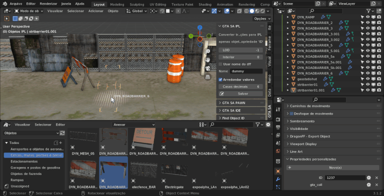
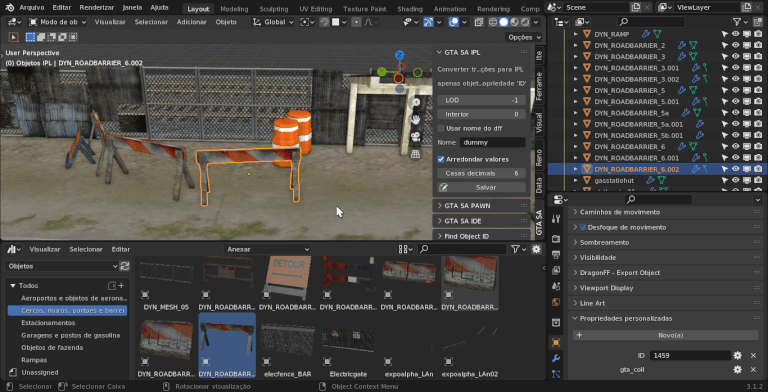
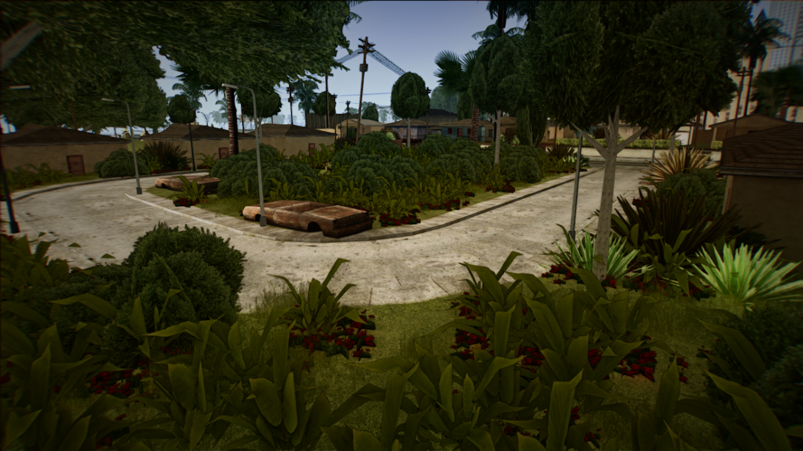
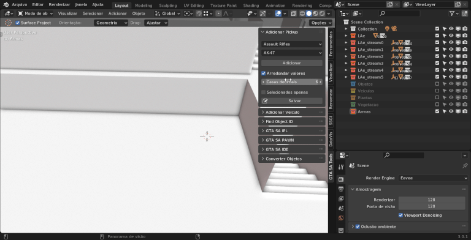
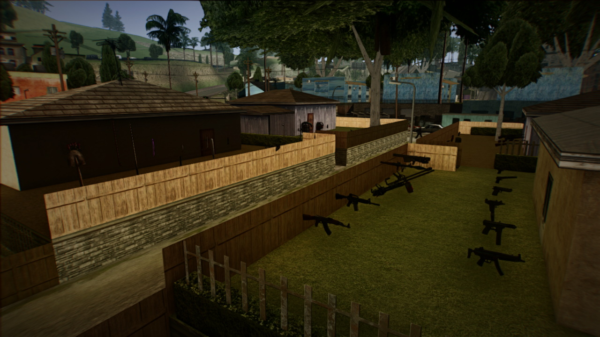

# GTA SA Tools

Ferramentas para auxiliar na exportação de arquivos para o GTA San Andreas. Como, por exemplo, .ipl, .pwn e .ide.

## Find Object ID

Este formato de arquivo é suficiente para que a busca seja executada corretamente:

```
3626, dcKwRKhut
3169, trailER_largE2_01
9238, moRESfnSHIT28
```

Simplesmente o ID e o nome do dff...

## Converter Objetos

Para converter os materiais, será necessário selecionar o diretório que contém as texturas dos objetos importados. Pois, é feito uma busca do endereço da imagem, pelo menos por enquanto.


## Exportar IPL e PAWN

Para exportar os objetos para arquivo .ipl e/ou .pwn será necessário apenas ter em sua cena objetos com a propriedade 'ID' - com seus valores corretos, que foram importados e nome do modelo .dff.



Depois de criar e posicionar seus objetos na cena, apenas salve e selecione a pasta de destino, na qual será criado o arquivo.



Após ser criado, você deve criar um arquivo de texto para o mesmo ser carregado. Da seguinte forma:

```
IPL data\maps\nome_do_seu_arquivo.ipl
```

Feito isso, é só abrir seu jogo e verificar se tudo está como você desejava :)


## Geometry Nodes

O [geometry nodes](https://docs.blender.org/manual/en/latest/modeling/geometry_nodes/index.html) funciona muito bem para gerar objetos. Isso facilita e muito na geração de plantas e props espalhados pelo mapa. Principalmente quando se trata de centenas ou milhares de objetos.

Fiz um simples teste com três tipos de planta:

https://youtu.be/meth7W5avhI



## Adicionar Pickups

Para adicionar basta você selecionar sua categoria e a arma/pickup que deseja. Um cubo será instanciado 1 metro acima do "3D Cursor".



Feito isso, é só salvar em um arquivo .ipl.



Funciona também para modelos e/ou armas customizadas. Basta apenas adicionar a propriedade "PICK" do tipo texto contendo seu respectivo ID em seu objeto.
